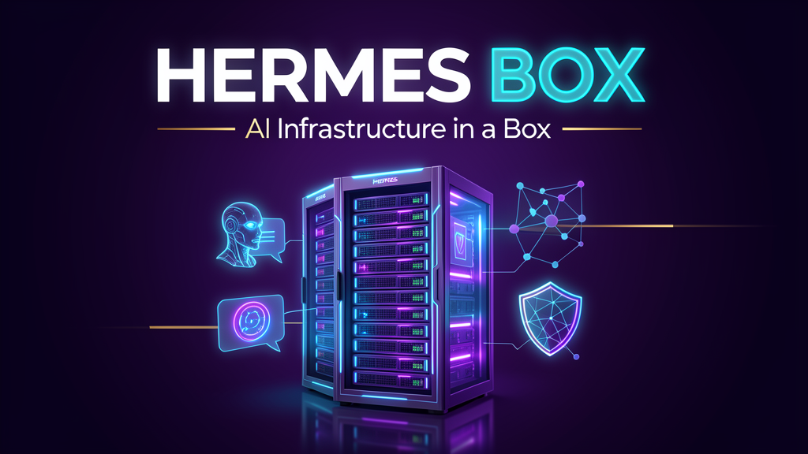
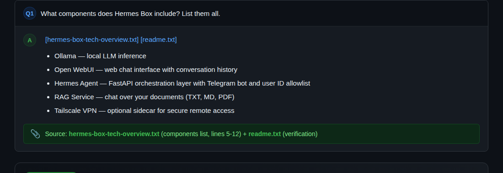
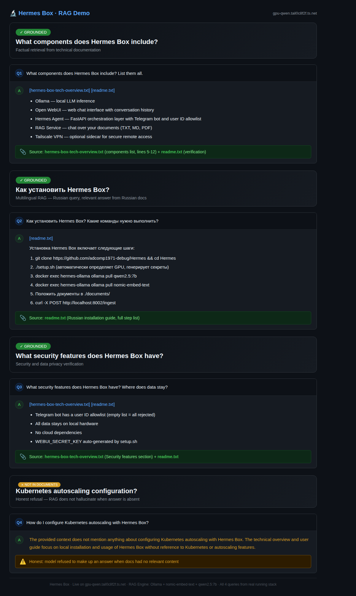
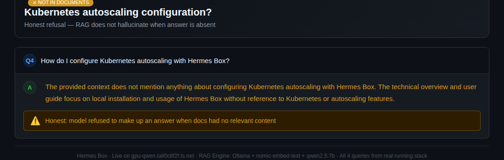
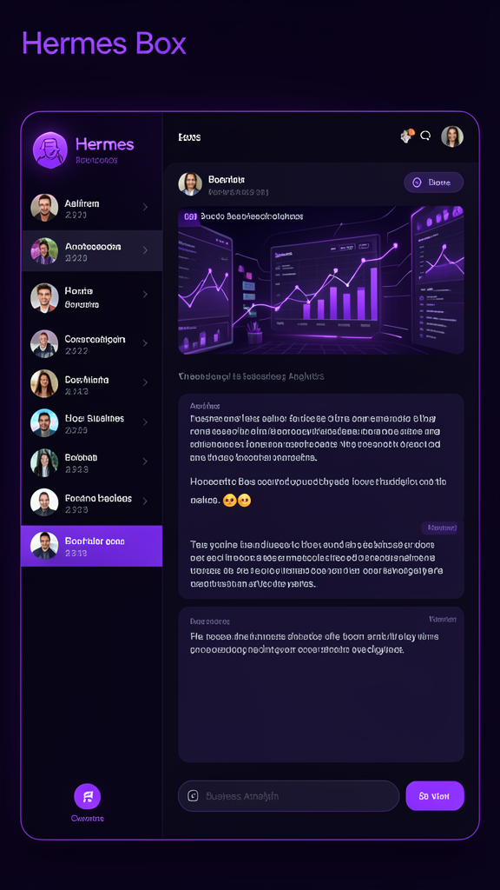

<p align="center">
  
</p>

<br>

<div align="center">

# 🤖 Hermes Box

**AI Infrastructure in a Box** — Self-hosted LLM Stack for Small and Medium Business

<br>

[](LICENSE)
[](docker-compose.yml)
[](#-hardware-requirements)
[](#-hardware-requirements)
[](#-features)
[](#-quick-start)

<br>

[🚀 Quick Start](#-quick-start) •
[🏗️ Architecture](#-architecture) •
[📊 Tiers](#-deployment-tiers) •
[🔧 Configuration](#-configuration) •
[📖 Documentation](ARCHITECTURE.md)

</div>

---

## 💡 What is Hermes Box?

Hermes Box is a **self-hosted AI stack** for your office. It runs entirely on your hardware — no cloud, no data leaving your network.

```bash
# 3 commands to a running stack, then drop your docs:
git clone https://github.com/adcomp1971-debug/Hermes
cd Hermes && ./setup.sh
docker exec hermes-ollama ollama pull qwen2.5:7b
# → Open http://localhost:3000 → Chat with your private AI
# → Drop docs in ./documents/ → POST /ingest → RAG-ready
```

> **Note:** First `ollama pull` downloads ~4.7 GB and can take 5–15 minutes on CPU.

### What's the actual value?

All components Hermes Box uses already exist as separate projects — Ollama, Open WebUI, Tailscale. The problem is **assembly**:
- Wiring containers together so they actually talk to each other
- Setting up Telegram bot with user allowlist so randoms can't access it
- Making RAG that doesn't hallucinate or lose context
- Adding VPN so it works from home without opening ports
- Documenting everything so a non-devops person can set it up

That normally takes a day of fighting configs. Hermes Box is a pre-assembled `docker-compose.yml` that just works in 5 minutes.

### Why not just use ChatGPT?

| Problem | Hermes Box Solution |
|---------|-------------------|
| ChatGPT costs $20–$30/user/month | **One-time hardware cost, $0/user** |
| Cloud AI trains on your data | **100% private, runs on your hardware** |
| Need DevOps to deploy AI | **Pre-assembled stack, 5 minutes** |
| Team needs remote access | **Built-in VPN (Tailscale)** |
| No internet? No AI | **Runs fully offline** |

---

## ✨ What makes it different

### 📄 RAG That Actually Works

RAG (Retrieval-Augmented Generation) means AI answers from **your documents**, not from its training data. Sounds simple, but most RAG implementations have common failure modes:

- Answers come without sources — no way to verify
- Sources point to nothing useful
- Model **hallucinates** when docs don't contain the answer
- Requires a separate vector database (Pinecone, Qdrant, Weaviate)
- Chunks are poorly split — answers lose context

**Hermes Box RAG does it differently:**

- **Vector storage is numpy.** Yes, a numpy array saved to disk. No extra services, nothing to configure, never crashes
- **Every answer cites its source file.** Not a vague reference — "taken from readme.txt" with the filename visible
- **Honest refusal.** If the document corpus has no relevant content, the model says "the context does not contain this" instead of making something up
- **Multilingual.** Ask in Russian, get answers from Russian docs. Ask in English, get answers from English docs
- **Similarity threshold of 0.35.** Below that, the model doesn't guess — it refuses

See the screenshots below for live examples from a running instance.

### 🧩 Expandable via Skills

Hermes Agent supports **Skills** — modular capabilities you can add at any time.

Want the bot to work with Google Sheets? Add a skill. Need daily reports? Add a skill. Email, task tracking, analytics, code review — all through the same interface.

Skills are plain Python files with natural-language instructions. You don't need to be a developer to add one — describe what the bot should do, and it follows the instructions.

### 🔧 Everything else

| Feature | What it does |
|---------|-------------|
| **🧠 Private LLM** | Ollama with Qwen, Llama, Nemotron — fully local |
| **💬 Web Chat UI** | Open WebUI with conversations, file uploads, model switching |
| **🤖 Telegram Bot** | AI assistant in Telegram, gated by user ID allowlist |
| **🔐 VPN Included** | Tailscale sidecar for secure remote access (free account required) |
| **📦 Pre-assembled** | `./setup.sh` generates secrets, detects GPU, starts everything |

---

## 🏗️ Architecture

```
┌──────────────────────────────────────────────────────────────────────┐
│                        USER ACCESS LAYER                              │
│   ┌──────────┐   ┌──────────────┐   ┌──────────────────┐            │
│   │   🌐     │   │   📱        │   │   🔐             │            │
│   │ Web UI   │   │ Telegram Bot│   │   VPN Client     │            │
│   │ :3000    │   │             │   │   (Tailscale)    │            │
│   └────┬─────┘   └──────┬──────┘   └────────┬─────────┘            │
│        │                │                    │                       │
├────────┼────────────────┼────────────────────┼──────────────────────┤
│        │       SERVICE LAYER                 │                      │
│   ┌────▼────────────┬───▼────────────┬──────▼──────────┐           │
|   │  Hermes Agent   │  RAG Service     │  Tailscale      │           │
│   │  :8787          │  :8002           │  VPN Gateway    │           │
│   │  Orchestration  │  Doc Chat        │  Mesh Network   │           │
│   └────┬────────────┴───┬────────────┴──────┬──────────┘           │
│        │                │                    │                       │
│   ┌────▼────────────────▼──────────────────────┐                    │
│   │           AI INFERENCE LAYER                │                    │
│   │   ┌────────────────────────────────────┐   │                    │
│   │   │  Ollama / NVIDIA NIM               │   │                    │
│   │   │  Qwen 2.5 · Llama 3 · Nemotron    │   │                    │
│   │   │  TensorRT-LLM · Triton Server     │   │                    │
│   │   └──────────────┬─────────────────────┘   │                    │
│   └─────────────────┼─────────────────────────┘                    │
│                     │                                               │
├─────────────────────┼───────────────────────────────────────────────┤
│              HARDWARE LAYER                                         │
│   ┌──────────┐  ┌──────────┐  ┌──────────┐  │
│   │ RTX 3060 │  │ RTX 4090 │  │ A100     │  │
│   │ 12GB VRAM│  │ 24GB VRAM│  │ 80GB VRAM│  │
│   │      Small Office    │  │   Business    │  │
│   └──────────┘  └──────────┘  └──────────┘  │
└──────────────────────────────────────────────────────────────────────┘
```

**Data flow:**
1. User sends message via Web UI, Telegram, or VPN
2. Hermes Agent receives and routes
3. RAG adds context from your documents if relevant
4. Ollama runs inference on local GPU
5. Response flows back through the chain to the user

---

## 📊 Deployment Tiers

| Tier | Users | Hardware | Model | Profile |
|------|-------|----------|-------|---------|
| 🥉 **Small Office** | 5–20 | RTX 3060/4060 (12GB) or CPU | Qwen 2.5 7B / Llama 3.1 8B | `basic` |
| 🥈 **Business** | 20–100 | 2× RTX 4090 / A100 (80GB) | Qwen 2.5 32B / Nemotron Nano | `gpu` |

> 💡 **No GPU?** Use `basic` profile with Qwen 2.5 7B on CPU. Slower but fully functional.

---

## 🚀 Quick Start

### Prerequisites

- [Docker](https://docs.docker.com/engine/install/) + [Docker Compose](https://docs.docker.com/compose/install/)
- Linux or macOS (Windows via WSL2)
- Optional: NVIDIA GPU + [nvidia-container-toolkit](https://docs.nvidia.com/datacenter/cloud-native/container-toolkit/install-guide.html)

### Quick Start

```bash
# 1. Clone
git clone https://github.com/adcomp1971-debug/Hermes
cd Hermes

# 2. Run setup (auto-detects GPU, generates secrets)
./setup.sh

# 3. Pull a model (first pull downloads ~4.7 GB)
docker exec hermes-ollama ollama pull qwen2.5:7b

# Then drop your documents and index:
docker exec hermes-ollama ollama pull nomic-embed-text
cp your-docs/*.pdf documents/
curl -X POST http://localhost:8002/ingest
```

### Docker Compose Profiles

```bash
# CPU-only (basic stack)
docker compose --profile basic up -d

# With GPU support
docker compose --profile gpu up -d

# Full enterprise stack
docker compose --profile full up -d
```

---

## 🔧 Configuration

### Minimal `.env`

```bash
TELEGRAM_BOT_TOKEN=***     # From @BotFather (optional)
WEBUI_SECRET_KEY=***       # Auto-generated if empty
TS_AUTHKEY=***             # Tailscale auth key (optional)
```

### Hermes Agent (`config/hermes.yaml`)

Configure agent behavior, tool access, and model selection:
- **Model:** Switch between Ollama, NVIDIA NIM, or external API
- **Tools:** Enable/disable terminal, file, web access
- **Gateway:** Telegram, webhook, or direct CLI

See [docs/deployment.md](docs/deployment.md) for full configuration reference.

---

## 🖥️ Screenshots

### RAG — Grounded Answers with Source Citations

<div align="center">
  
  <br><br>
  
  <br><br>
  
  <br>
  <sub><strong>↑</strong> Live RAG from a running Hermes Box: every answer includes a visible source citation. When docs don't contain the answer — the model refuses to hallucinate.</sub>
</div>

### Web UI

<div align="center">
  
</div>

---

## 📚 Documentation

| Document | Description |
|----------|-------------|
| [ARCHITECTURE.md](ARCHITECTURE.md) | Deep dive into system design |
| [docs/quickstart.md](docs/quickstart.md) | Step-by-step for non-technical users |
| [docs/deployment.md](docs/deployment.md) | Production deployment guide |
| [examples/small-office](examples/small-office/) | Small office config & walkthrough |
| [examples/business](examples/business/) | Business tier deployment |

---

## 🛡️ Security

- **VPN** — All traffic through encrypted mesh (Tailscale)
- **No Cloud** — Your data never leaves your hardware
- **Telegram Allowlist** — Only approved user IDs can access the bot

See [SECURITY.md](SECURITY.md) for full details.

---

## 🤝 Contributing

Contributions welcome! See [CONTRIBUTING.md](CONTRIBUTING.md) for guidelines.

**Ideas for contributions:**
- Add support for more models (Mistral, Gemma, Phi)
- Create Helm chart for Kubernetes deployment
- Add monitoring with Prometheus/Grafana
- Build a mobile app
- Translate docs to other languages

---

## 📄 License

MIT © [Alex Skver](https://github.com/adcomp1971)

---

<div align="center">
  <sub>Built with ❤️ for businesses that value privacy and independence from cloud AI.</sub>
</div>
